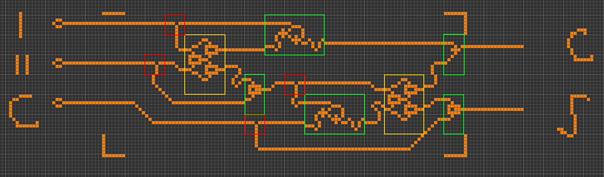

EDIF2Wireworld project (formerly Verilog2Wireworld).

Utility that accepts a description of a digital circuit as a EDIF-netlist and performs Placement-and-Routing to "manufacture" the given circuit as a Wireworld cellular automaton pattern (<http://en.wikipedia.org/wiki/Wireworld>).
The resulting pattern is functionally equivalent to the supplied digital circuit.
The resulting Wireworld patterns are given as RLE files that can be opened by Golly (<http://golly.sourceforge.net>).

EDIF (<http://en.wikipedia.org/wiki/EDIF>) is the file format which can hold a description of a digital circuit. One way of obtaining such a file is compiling a Verilog source file by a utility such as Icarus Verilog (<http://iverilog.icarus.com>).

The purpose of the project is to explore the digital electronics emulation capabilities of the Wireworld cellular automaton.

This is my Master thesis project at International IT University, Almaty, Kazakhstan (<http://www.iitu.kz>), 2015.
Student: Alexandr Nigay.
Supervisor: Dr. Vladislav Gladkikh (<https://burubaxair.wordpress.com>).

Usage:

`python edif2ww\edif2ww.py <input_file>.edf`

This will produce `<input_file>.rle` file with the "manufactured" circuit in the form of a Wireworld pattern which can be emulated with Golly.

